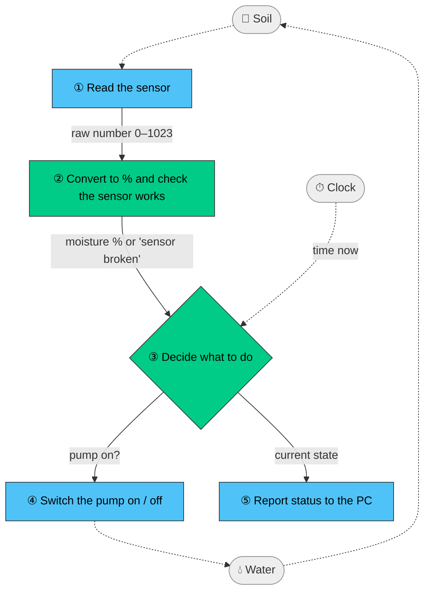

# plant_waterer

An automatic plant watering system on an Arduino Uno. It reads a capacitive soil moisture
sensor and waters the plant in small, timed doses through a relay-switched pump.

> **Status:** firmware and unit tests complete; waiting on hardware calibration and on-board checks.

## Safety by design


- **Fixed doses with soak time.** The pump runs for a few seconds, then waits for the water to
  reach the sensor before measuring again. This prevents overwatering caused by sensor lag.
- **Hard limits.** Each dose is time-limited, and too many doses in a row (empty tank, stuck
  sensor) trigger a fault.
- **Fail-safe.** The pump is off at boot and in any fault; a fault stays until a person resets.
- **Hysteresis.** Watering starts below one moisture level and stops above a higher one, so the
  pump never toggles rapidly around a single threshold.

## Architecture

The watering logic is plain C++ with no Arduino dependencies, so it is unit-tested on a PC.
Hardware access sits in thin wrappers at the edges.



🟩 Green = pure logic, unit-tested on the PC · 🟦 Blue = hardware, checked on the board

More detail: [design](docs/design.md) (components, state machine).

## Hardware

Arduino Uno (USB power) · capacitive soil moisture sensor on **A0** · 1-channel relay module
(active-LOW) on **D10** · small water pump on its own 3.7 V 18650 battery, switched by the relay.

## Configuration

All tunables live in [`include/config.h`](include/config.h). Pick the plant with one line,
e.g. `ACTIVE_PLANT = MINT` (presets: cactus, herbs, lemongrass, mint, fern).

## Build, test, run

Requires [PlatformIO](https://platformio.org/).

```bash
pio test -e native            # run the unit tests on the PC
pio run -e uno                # build firmware
pio run -e uno -t upload      # flash the board
pio device monitor            # watch the status output
```
