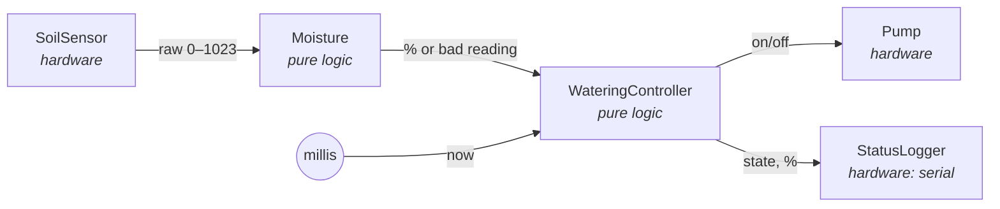

# plant_waterer

An automatic plant watering system on an Arduino Uno. It reads a capacitive soil moisture
sensor and waters the plant in small, timed doses through a relay-switched pump.

> **Status:** work in progress. Design done; firmware and unit tests are being built.

## Safety by design


- **Fixed doses with soak time.** The pump runs for a few seconds, then waits for the water to
  reach the sensor before measuring again. This prevents overwatering caused by sensor lag.
- **Hard limits.** Each dose is time-limited, and too many doses in a row (empty tank, stuck
  sensor) trigger a fault.
- **Fail-safe.** The pump is off at boot and in any fault; a fault stays until a person resets.
- **Hysteresis.** Watering starts below one moisture level and stops above a higher one, so the
  pump never toggles rapidly around a single threshold.

## Architecture

The watering logic is plain C++ with no Arduino dependencies, so it is unit-tested on a PC.
Hardware access sits in thin wrappers at the edges.



More detail: [design](docs/design.md) (components, state machine) ·
[decision log](docs/decisions.md) (trade-offs and why).

## Hardware

Arduino Uno · capacitive soil moisture sensor · 1-channel relay module · small water pump with
its own power supply.

## Build

Requires [PlatformIO](https://platformio.org/).

```bash
pio run -e uno                # build firmware
pio run -e uno -t upload      # flash the board
```
