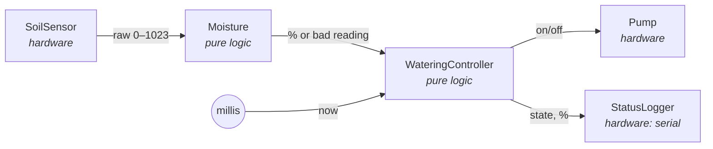
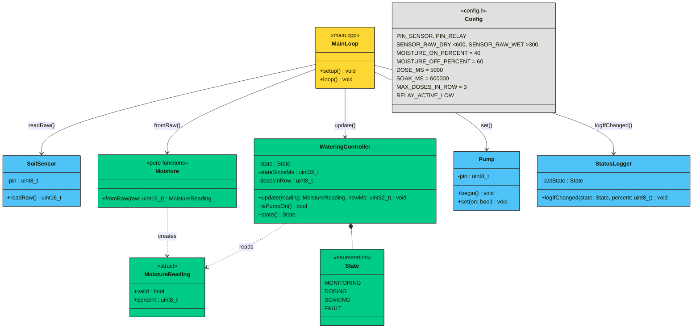
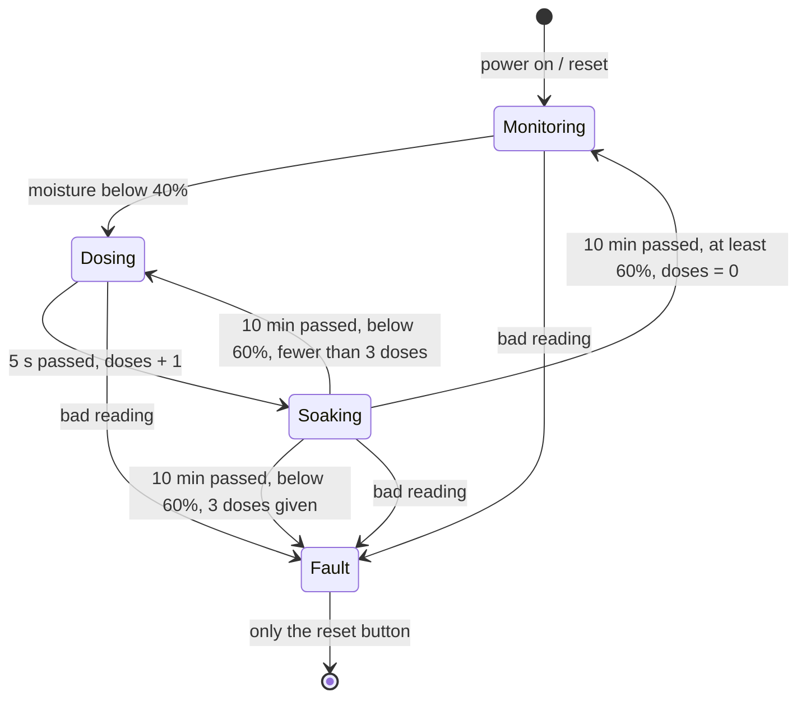

# Design

An Arduino Uno reads a soil moisture sensor and waters the plant in small doses through a
relay-switched pump. Watering logic is plain C++ with no `Arduino.h`, so it is unit-tested on the PC.

## Architecture

One `loop()` pass moves data left to right. Logic never calls hardware; only `main.cpp` knows
every part.

## Components

Green = pure logic, unit-tested on the PC. Blue = hardware, verified on the board.

| Component | Responsibility |
|-----------|----------------|
| `Config` | Every tunable number (pins, calibration, thresholds, timings) in one place |
| `SoilSensor` | Read the raw ADC value from the sensor pin |
| `Moisture` | Raw value → 0–100 % (clamped); flag readings outside the calibrated range |
| `WateringController` | The state machine below; time comes in as a parameter, so tests control it |
| `Pump` | Drive the relay; starts OFF at boot; hides whether the relay is active-LOW |
| `StatusLogger` | Print a line over serial when the state changes |
| `MainLoop` | Wire the parts together, once per `loop()` pass |

## State machine

Watering is a fixed dose, then a soak, then a fresh measurement (see decision #7).

| State | Pump | Leaves when |
|-------|------|-------------|
| Monitoring | off | Moisture below 40 % → Dosing |
| Dosing | **on** | 5 s passed → Soaking (doses + 1) |
| Soaking | off | After 10 min: at least 60 % → Monitoring (doses = 0); below 60 % → Dosing, or Fault after 3 doses |
| Fault | off | Never by itself; reset restarts in Monitoring (decision #8) |
| *any* | — | Bad sensor reading → Fault |

All numbers are placeholders from `Config`; calibration (Milestone 1) sets the real ones.
